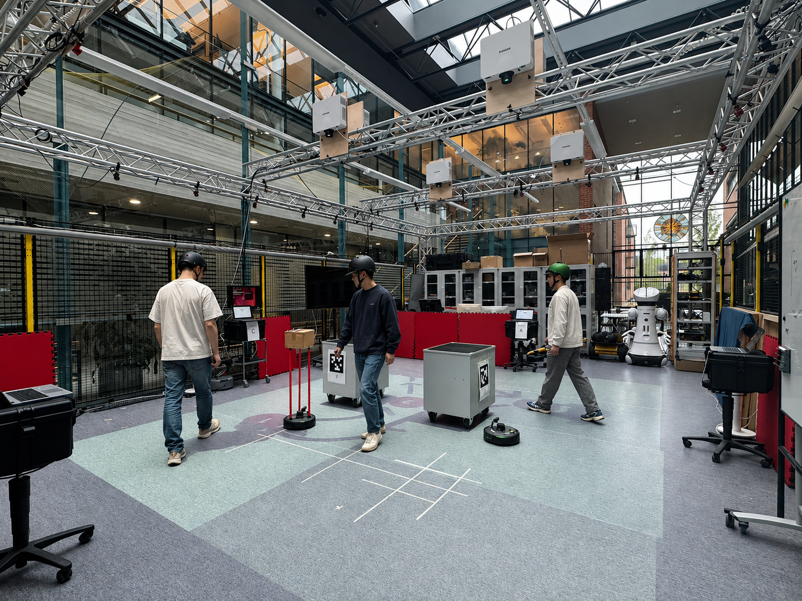

# CAGE Toolkit

**Tools for processing, inspecting, and analyzing human and robot trajectories from the CAGE dataset.**

<p align="center">
  
</p>

## Features

* Parse OptiTrack CSV recordings
* Normalize coordinate systems
* Detect human and robot tracks
* Trim trajectories to valid motion periods
* Check tracking quality
* Compute trajectory and motion metrics
* Compute THÖR-style trajectory statistics
* Analyze minimum distances between people
* Visualize trajectories and sensor data
* Analyze participant survey data
* Generate reproducible dataset-level summaries
* Configure dataset-specific parameters through YAML

## Installation

Clone the repository:

```bash
git clone https://github.com/MaryamKazemi96/tracking-toolkit.git
cd tracking-toolkit
```

## Dataset Organization

The toolkit expects the OptiTrack recordings to be organized by session.

A typical structure is:

```text
data/
└── OptiTrack/
    ├── raw/
    │   ├── session 1/
    │   ├── session 2/
    │   ├── ...
    │   └── session 8/
    │
    └── solved/
        ├── session 1/
        ├── session 2/
        ├── ...
        └── session 8/
```

Each session contains recordings for the corresponding scenarios.

## Configuration

Dataset-specific parameters are stored in:

```text
config/recordings.yaml
```

For example:

```yaml
dataset:
  fps: 120
  up_axis: y
  coordinate_system: global
```

The configuration file also defines:

* Available sessions and scenarios
* Participant rigid bodies
* Robot rigid bodies
* Preprocessing parameters

## Quick Start

### Inspect the Dataset

```bash
python scripts/inspect_dataset.py
```

This provides an overview of the available recordings and tracked rigid bodies.

### Check Tracking Quality

```bash
python scripts/check_quality.py
```

This can be used to identify potential tracking problems before further analysis.

### Compute Trajectory Metrics

```bash
python scripts/compute_thor_metrics.py
```

The toolkit computes:

* Tracking duration
* Motion speed
* Trajectory curvature
* Perception noise
* Minimum distance between people

### Visualize Trajectories

```bash
python scripts/plot_scenario_trajectories.py
```

Additional visualization scripts are available in the `scripts/` directory.

## Project Structure

```text
tracking-toolkit/
├── config/
│   ├── recordings.yaml
│   └── schema.py
│
├── scripts/
│   ├── analyze_survey.py
│   ├── check_quality.py
│   ├── compute_session_summary.py
│   ├── compute_summary_metrics.py
│   ├── compute_thor_metrics.py
│   ├── inspect_dataset.py
│   ├── plot_min_human_distance.py
│   ├── plot_rosbag_sensors.py
│   ├── plot_scenario_trajectories.py
│   └── plot_thor_metrics.py
│
└── src/
    ├── inspect/
    ├── io/
    ├── metrics/
    ├── preprocessing/
    ├── survey/
    └── visualization/
```
## Paper

For details about the dataset, experimental setup, and analysis, please see the  paper:
CAGE: A High-Precision Multimodal Human-Robot Coexistence Dataset with Explicit Robot Intent Communication

Paper

## Dataset

The complete dataset and additional information are available on the dataset webpage:

Dataset Webpage
## License


## Acknowledgements

This work was developed as part of research on human–robot coexistence and multi-robot systems at Aalto University.
## Contact
The cage toolkit has been developed by Maryam Kazemi. For questions, issues, or further information, please contact: maryam.kazemieskeri@aalto.fi.
